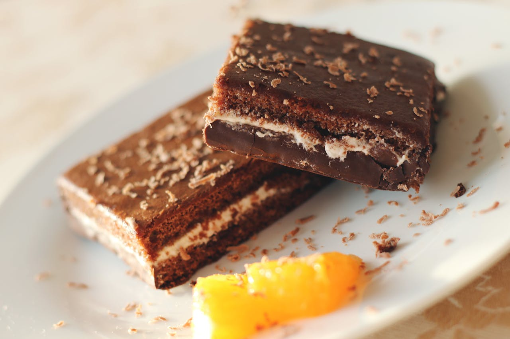
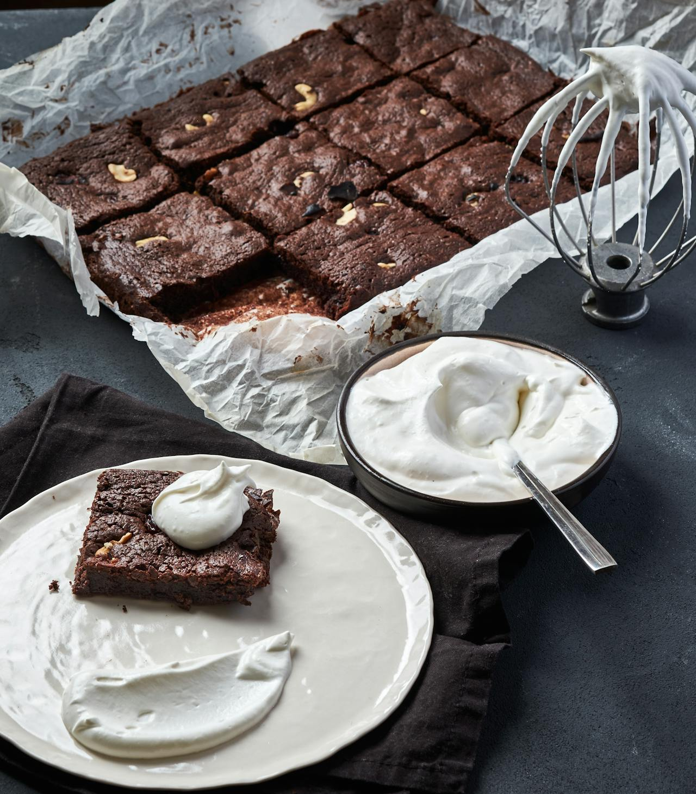
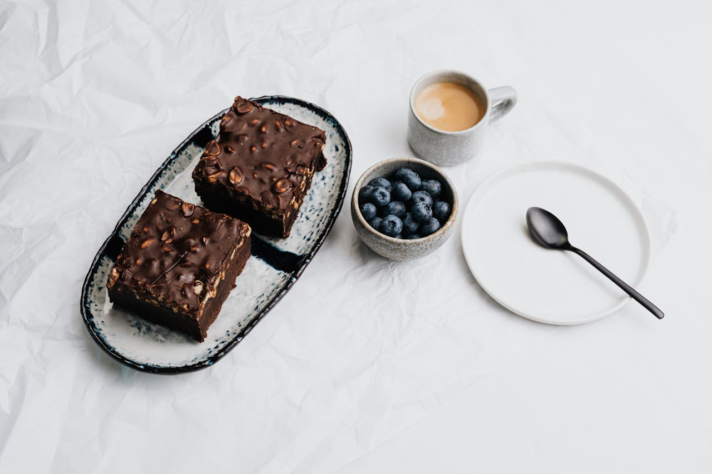
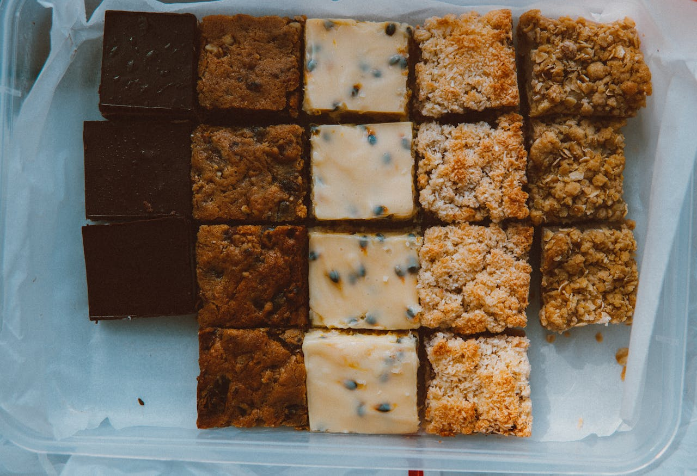

<!DOCTYPE html>
<html lang="es">

<head>
    <meta charset="UTF-8">
    <meta name="viewport" content="width=device-width, initial-scale=1.0">
    <title>Rey del Brownie - El Brownie Perfecto para Cada Momento</title>
    <!-- Tailwind CSS CDN -->
    
    <!-- Font Inter from Google Fonts -->
    <link rel="preconnect" href="https://fonts.googleapis.com">
    <link rel="preconnect" href="https://fonts.gstatic.com" crossorigin>
    <link href="https://fonts.googleapis.com/css2?family=Inter:wght@400;600;700&display=swap" rel="stylesheet">
    <!-- Font Awesome for social media icons -->
    <link rel="stylesheet" href="https://cdnjs.cloudflare.com/ajax/libs/font-awesome/6.1.1/css/all.min.css">
    
</head>

<body class="text-gray-800">

    <!-- Header Section -->
    <header class="bg-white/70 backdrop-blur-md sticky top-0 z-50 shadow-sm">
        

            <a href="#" class="flex items-center space-x-2">
                <!-- Placeholder for the Rey del Brownie Logo -->
                
            </a>
            <nav class="hidden md:block">
                <ul class="flex space-x-8 text-lg font-semibold">
                    <li><a href="#flavors"
                            class="text-gray-700 hover:text-stone-600 transition-colors duration-300">Sabores</a></li>
                    <li><a href="#stats"
                            class="text-gray-700 hover:text-stone-600 transition-colors duration-300">Nuestros
                            Números</a></li>
                    <li><a href="#testimonials"
                            class="text-gray-700 hover:text-stone-600 transition-colors duration-300">Testimonios</a>
                    </li>
                    <li><a href="#contact-cta"
                            class="bg-stone-600 text-white py-2 px-4 rounded-full hover:bg-stone-700 transition-colors duration-300">Comprar
                            Ahora</a></li>
                </ul>
            </nav>
        

    </header>

    <main>
        <!-- Hero Section -->
        <section class="relative bg-gradient-to-br from-amber-100 to-rose-100 py-24 md:py-40 overflow-hidden">
            

                

                    <h2 class="text-5xl md:text-7xl font-extrabold leading-tight mb-6 text-stone-800 text-shadow-dark">
                        La Felicidad tiene Sabor a Chocolate
                    </h2>
                    

                        Descubre nuestros brownies artesanales, hechos con pasión y los mejores ingredientes para
                        brindarte un momento de pura indulgencia.
                    

                    <a href="#flavors"
                        class="inline-block bg-stone-600 text-white font-bold py-4 px-10 rounded-full shadow-lg hover:bg-stone-700 transform hover:scale-105 transition-all duration-300">
                        Explorar Nuestros Sabores
                    </a>
                

                

                    
                

            

        </section>

        <!-- Our Story Section -->
        <section id="about-us" class="py-24 bg-white">
            

                

                    

                        
                    

                    

                        <h3 class="text-4xl md:text-5xl font-bold mb-6 text-stone-800">Nuestra Historia</h3>
                        

                            En Rey del Brownie, creemos que un buen brownie es más que un postre; es una experiencia.
                            Comenzamos con una simple idea: crear el brownie perfecto. Cada lote es horneado con los
                            ingredientes más finos, desde cacao de origen hasta mantequilla real, para asegurar un sabor
                            y una textura inigualables.
                        

                    

                

            

        </section>

        <!-- Flavors Section -->
        <section id="flavors" class="bg-fcf8f6 py-24">
            

                <h3 class="text-4xl md:text-5xl font-bold text-center mb-16 text-stone-800">Descubre Nuestros
                    Irresistibles Sabores</h3>
                

                    <!-- Flavor Card 1 -->
                    

                        
                        <h4 class="text-2xl font-semibold mb-2 text-center text-stone-800">El Clásico de Chocolate</h4>
                        
El brownie original, con un sabor a chocolate intenso y una
                            textura suave y húmeda.

                    

                    <!-- Flavor Card 2 -->
                    

                        
                        <h4 class="text-2xl font-semibold mb-2 text-center text-stone-800">Con Nuez de la India</h4>
                        
Nuestro clásico elevado, con el toque crujiente de nueces
                            recién tostadas.

                    

                    <!-- Flavor Card 3 -->
                    

                        
                        <h4 class="text-2xl font-semibold mb-2 text-center text-stone-800">Tentación de Chocolate Blanco
                        </h4>
                        
Una variante dulce y cremosa, perfecta para los amantes del
                            chocolate blanco.

                    

                

            

        </section>

        <!-- Stats Section -->
        <section id="stats" class="bg-white py-24">
            

                <h3 class="text-4xl md:text-5xl font-bold mb-16 text-stone-800">Nuestros Números Hablan por Sí Mismos
                </h3>
                

                    

                        10,000+
                        
Brownies Vendidos al Mes

                    

                    

                        5+
                        
Provincias de Cobertura

                    

                    

                        99%
                        
Satisfacción del Cliente

                    

                

            

        </section>

        <!-- Testimonials Section -->
        <section id="testimonials" class="bg-stone-700 text-white py-24">
            

                <h3 class="text-4xl md:text-5xl font-bold mb-16">Lo que Nuestros Clientes Dicen</h3>
                

                    <!-- Testimonial 1 -->
                    

                        
"Simplemente los mejores brownies que he probado. La textura es
                            perfecta y el sabor es increíblemente intenso."

                        
- Ana G.

                    

                    <!-- Testimonial 2 -->
                    

                        
"Cada bocado es una delicia. Siempre pido para mis eventos y mis
                            invitados los aman."

                        
- Carlos P.

                    

                    <!-- Testimonial 3 -->
                    

                        
"Increíble calidad y un servicio excelente. Son mi nueva obsesión
                            de postre."

                        
- Sofía R.

                    

                

            

        </section>

        <!-- Final Call to Action Section -->
        <section id="contact-cta" class="bg-fcf8f6 py-24">
            

                <h3 class="text-4xl md:text-5xl font-bold mb-6 text-stone-800">¿Listo para un Momento Inolvidable?</h3>
                

                    Pide tus brownies ahora y déjanos endulzar tu día.
                

                <a href="#"
                    class="inline-block bg-pink-500 text-white font-bold py-4 px-10 rounded-full shadow-lg hover:bg-pink-600 transform hover:scale-105 transition-all duration-300">
                    Comprar Ahora
                </a>
            

        </section>
    </main>

    <!-- Footer -->
    <footer class="bg-stone-800 text-gray-300 py-12">
        

            

                <!-- Search Column -->
                

                    <h5 class="text-2xl font-bold mb-4 text-white">Búsqueda</h5>
                    <form action="#" method="get">
                        

                            <input type="search" placeholder="Buscar..."
                                class="w-full bg-stone-700 text-white px-4 py-2 rounded-lg border border-stone-600 focus:outline-none focus:ring focus:ring-stone-500">
                            <button type="submit"
                                class="absolute right-0 top-0 mt-2 mr-4 text-gray-400 hover:text-white">
                                <i class="fas fa-search"></i>
                            </button>
                        

                    </form>
                

                <!-- Contact Column -->
                

                    <h5 class="text-2xl font-bold mb-4 text-white">Contacto</h5>
                    <address class="not-italic text-gray-400 space-y-2">
                        
<i class="fas fa-map-marker-alt mr-2"></i> Calle Principal 123, Ciudad, País

                        
<i class="fas fa-phone mr-2"></i> (809) 305-9027

                        
<i class="fas fa-envelope mr-2"></i> contacto@reydelbrownie.com

                    </address>
                

                <!-- Useful Links Column -->
                

                    <h5 class="text-2xl font-bold mb-4 text-white">Enlaces Útiles</h5>
                    <ul class="text-gray-400 space-y-2">
                        <li><a href="#" class="hover:text-white transition-colors duration-300">Acerca de Nosotros</a>
                        </li>
                        <li><a href="#" class="hover:text-white transition-colors duration-300">Preguntas Frecuentes</a>
                        </li>
                        <li><a href="#" class="hover:text-white transition-colors duration-300">Términos y
                                Condiciones</a></li>
                        <li><a href="#" class="hover:text-white transition-colors duration-300">Política de
                                Privacidad</a></li>
                    </ul>
                

                <!-- Social Media Column -->
                

                    <h5 class="text-2xl font-bold mb-4 text-white">Síguenos</h5>
                    

                        <a href="#" target="_blank" class="text-gray-400 social-icon"><i
                                class="fab fa-facebook-f"></i></a>
                        <a href="#" target="_blank" class="text-gray-400 social-icon"><i
                                class="fab fa-instagram"></i></a>
                        <a href="#" target="_blank" class="text-gray-400 social-icon"><i class="fab fa-twitter"></i></a>
                    

                

            

            

                
&copy; 2024 Rey del Brownie. Todos los derechos reservados.

            

        

    </footer>
</body>

</html>